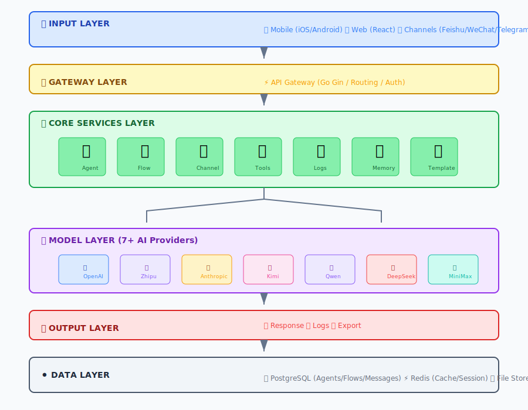

# CorpFlow

<p align="center">
  
</p>

**Multi-Agent Collaboration Platform**

[](https://opensource.org/licenses/MIT)
[](https://flutter.dev)

> **中文**: [README_zh.md](./README_zh.md)

---

## Overview

CorpFlow is a **multi-agent collaboration platform** that enables you to:
- Create and manage AI agents
- Build visual workflows with drag-and-drop
- Deploy across multiple channels (Feishu, WeChat, Telegram, Discord)
- Use multiple AI models with intelligent voting

---


## Architecture




1. **🔀 Visual Flow Editor** - Unlike CLI tools, CorpFlow provides a visual drag-and-drop workflow builder that's easy to use

2. **🗳️ Multi-Model Voting** - Unique feature! Let multiple AI models discuss and vote on the best answer

3. **📱 Mobile-First** - Full mobile app support for iOS, Android, Windows, macOS

4. **💬 Multi-Channel** - Deploy to Feishu, WeChat, Telegram, Discord simultaneously

5. **🧠 Hierarchical Memory** - Supervisors can view subordinate work history and generate reports

6. **🔧 Built-in Tools** - Shell, Git, Code Review, Test Generation, Web Search, File operations

7. **⚡ Ready Templates** - 8+ pre-built workflows: Chat, Voting, Research, Customer Service, Code Review, Content Creator, Data Analyzer, News Summarizer

---

## Features

| Feature | Description |
|---------|-------------|
| 🤖 **AI Agents** | Create custom AI agents with different models |
| 🔀 **Flow Builder** | Visual workflow automation with drag-and-drop |
| 💬 **Multi-Channel** | Feishu, WeChat, Telegram, Discord |
| 🗳️ **Multi-Model Voting** | Multiple AI models discuss and vote |
| 📱 **Mobile App** | iOS, Android, macOS, Windows, iPadOS |
| 🔧 **Tool Marketplace** | Shell, Git, Code Review, Test Gen, Calculator |
| 📋 **Execution Logs** | Step-by-step execution tracking |
| 🧠 **Memory System** | Hierarchical agent relationships |

---

## Supported AI Models

| Model | Provider | Env Variable |
|-------|----------|--------------|
| GPT-4 / GPT-4 Turbo | OpenAI | `OPENAI_API_KEY` |
| Claude 3 Opus / Sonnet | Anthropic | `ANTHROPIC_API_KEY` |
| GLM-4 / GLM-4 Flash | Zhipu | `ZHIPU_API_KEY` |
| Kimi | Moonshot | `KIMI_API_KEY` |
| Qwen Turbo / Plus | Alibaba | `DASHSCOPE_API_KEY` |
| DeepSeek Chat / Coder | DeepSeek | `DEEPSEEK_API_KEY` |
| MiniMax | MiniMax | `MINIMAX_API_KEY` |

---

## Quick Start

### Backend (Go + Docker)

```bash
# Clone the repo
git clone https://github.com/gotonote/corpflow.git
cd corpflow

# Copy configuration
cp .env.example .env

# Edit .env with your API keys
vim .env

# Start with Docker
docker-compose up -d
```

### Frontend (React)

```bash
cd frontend

# Install dependencies
npm install

# Start development server
npm run dev

# Open http://localhost:3000
```

### Mobile App (Flutter)

```bash
cd mobile

# Install dependencies
flutter pub get

# Run in development
flutter run

# Build for Android
flutter build apk --release
```

---

## Demo: How to Use Visual Flow Editor

### Step 1: Open Flow Editor

Navigate to **Flows** tab in the web interface.

### Step 2: Drag Nodes from Sidebar

The left sidebar contains node types:

```
📦 Node Library
├── ⚡ Trigger (消息触发)
│   ├── Message Trigger
│   ├── Scheduled Task  
│   └── Webhook
├── 🤖 Agent (AI智能体)
│   └── Custom AI Agent
├── 🧠 LLM (大模型)
│   └── GPT-4 / Claude / GLM-4
├── 🔀 Condition (条件分支)
│   └── If/Else branching
├── 🔧 Tool (工具)
│   ├── Browser
│   ├── Web Search
│   ├── Calculator
│   └── Code Execution
└── 📤 Output
    └── Return Result
```

### Step 3: Connect Nodes

1. Click the **handle** (dot) on the bottom of a node
2. Drag to the **handle** on the top of another node
3. Release to create a connection

### Step 4: Configure Node Properties

Click any node to open the **Properties Panel** on the right:

```
⚙️ Node Configuration
├── Name: "AI Assistant"
├── Description: "Main agent"
└── Model: [GPT-4 ▼]
    ├── GPT-4
    ├── Claude 3 Sonnet
    └── GLM-4
```

### Step 5: Save and Execute

```
┌─────────────────────────────────────┐
│ 💾 Save  │  ▶️ Execute  │ 📥 Import │
└─────────────────────────────────────┘
```

- **Save**: Saves flow to database
- **Execute**: Runs the workflow with current inputs

### Example Flow: Customer Service Bot

```
┌──────────┐    ┌──────────┐    ┌──────────┐    ┌──────────┐
│  Trigger │───▶│  Agent   │───▶│Condition │───▶│  Output  │
│ (用户消息)│    │(理解问题) │    │(已知问题?)│    │ (回复)   │
└──────────┘    └──────────┘    └──────────┘    └──────────┘
                              │
                    ┌─────────┴─────────┐
                    ▼                 ▼
              ┌──────────┐       ┌──────────┐
              │ Knowledge│       │  Human   │
              │  Base    │       │ Transfer │
              └──────────┘       └──────────┘
```

---

## Demo: Multi-Model Voting

### Enable Voting

Go to **Settings** → Enable **Multi-Model Voting**

### How It Works

1. User asks a question
2. Multiple AI models respond simultaneously
3. Models evaluate each other's answers
4. Best answer is selected by consensus

### Example

```
Question: "How to improve product user experience?"

┌────────────────────────────────────────────────┐
│ GPT-4's Answer                                 │
│ → Focus on onboarding flow                     │
│ → Score: 85                                    │
├────────────────────────────────────────────────┤
│ GLM-4's Answer                                 │
│ → Add personalization features                 │
│ → Score: 92 ⭐ (Winner)                        │
├────────────────────────────────────────────────┤
│ Kimi's Answer                                  │
│ → Improve mobile responsiveness                │
│ → Score: 78                                    │
└────────────────────────────────────────────────┘

Final Winner: GLM-4 (Score: 92)
```

---

## Demo: Using Tools

### Available Tools

| Tool | Description | Example |
|------|-------------|---------|
| `shell` | Execute shell commands | `{"command": "ls -la"}` |
| `git` | Git operations | `{"action": "commit", "message": "fix bug"}` |
| `web_search` | Search the web | `{"query": "CorpFlow AI"}` |
| `web_fetch` | Get web content | `{"url": "https://github.com"}` |
| `file_read` | Read file | `{"path": "/app/main.go"}` |
| `file_write` | Write file | `{"path": "/app/test.go", "content": "..."}` |
| `code_review` | AI code review | `{"code": "func main() {...}"}` |
| `test_gen` | Generate tests | `{"code": "func Add(a,b int) int", "framework": "go"}` |
| `calculator` | Math calculation | `{"expression": "2+2*3"}` |

### Run Tool Example

1. Go to **Tools** tab
2. Select a tool (e.g., Calculator)
3. Enter input: `{"expression": "100/5+20"}`
4. Click **Run**
5. View output: `Result: 100/5+20 = 40`

---

## How to Use Features

### 1. Chat with AI

1. Go to **Chat** tab
2. Select an agent
3. Type message
4. Get AI response

### 2. Create Workflow

1. Go to **Flows** tab
2. Drag nodes from sidebar
3. Connect them
4. Configure properties
5. Save & Execute

### 3. Manage Agents

1. Go to **Agents** tab
2. Click **+ Add Agent**
3. Set name, model, prompt
4. Save

### 4. View Execution Logs

1. Go to **Logs** tab
2. See all workflow runs
3. Click to see details
4. View step-by-step execution

---

## Connect Mobile App

To connect mobile app to local server:

1. Ensure phone and computer are on the same WiFi
2. Get your computer's IP:
   - Windows: `ipconfig`
   - Mac/Linux: `ifconfig`
3. In mobile app Settings, enter: `http://YOUR_IP:8080`

---

## Environment Variables

```bash
# AI Models
export OPENAI_API_KEY=sk-xxx
export ANTHROPIC_API_KEY=sk-ant-xxx
export ZHIPU_API_KEY=xxx
export KIMI_API_KEY=xxx
export DASHSCOPE_API_KEY=xxx
export DEEPSEEK_API_KEY=xxx
export MINIMAX_API_KEY=xxx

# Channels
export FEISHU_APP_ID=xxx
export FEISHU_APP_SECRET=xxx
export WECHAT_APP_ID=xxx
export TELEGRAM_BOT_TOKEN=xxx
```

---

## Troubleshooting

| Problem | Solution |
|---------|----------|
| Can't access localhost:3000 | Check if Docker is running: `docker ps` |
| API calls fail | Verify API Key is configured in Settings |
| Mobile can't connect | Check firewall / ensure same network |
| Flow won't execute | Check all nodes are connected properly |

---

## API Endpoints

| Method | Endpoint | Description |
|--------|----------|-------------|
| POST | `/api/agents` | Create agent |
| GET | `/api/agents` | List agents |
| POST | `/api/flows` | Create flow |
| POST | `/api/flows/:id/execute` | Execute flow |
| POST | `/api/tools/execute` | Execute tool |
| GET | `/api/logs` | Get execution logs |
| POST | `/webhook/feishu` | Feishu webhook |

---

## License

MIT License
