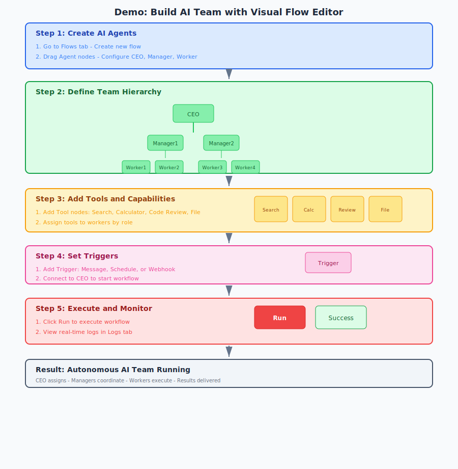

# CorpFlow

<p align="center">
  
</p>

**多智能体协作平台**

[](https://opensource.org/licenses/MIT)
[](https://flutter.dev)

> **English**: [README.md](./README.md)

---

## 概述

CorpFlow 是一个**多智能体协作平台**，支持：
- 创建和管理 AI 智能体
- 拖拽式可视化流程编排
- 多渠道部署（飞书、微信、Telegram、Discord）
- 多个 AI 智能体协同完成复杂任务

---


## 架构图


---

## 演示：构建你的 AI 团队



### CorpFlow 优势：

1. **🔀 可视化流程编辑器** - 不同于 CLI 工具，提供拖拽式可视化工作流

2. **🤝 多 Agent 协作** - 多个 AI 智能体协同工作，各有分工（CEO、Manager、Worker），共同完成复杂任务

3. **🔧 内置工具市场** - Shell、Git、代码审查、测试生成、网页搜索、文件操作

7. **⚡ 预置模板** - 8+ 个即用工作流：对话、研究、客服、代码审查、内容创作、数据分析、新闻摘要、软件开发

---

## 功能特性

| 功能 | 描述 |
|------|------|
| 🤖 **AI 智能体** | 创建自定义 AI 智能体，支持多种模型 |
| 🔀 **流程编排** | 拖拽式可视化工作流自动化 |
| 💬 **多渠道** | 飞书、微信、Telegram、Discord |
| 🤝 **多 Agent 协作** | 多个 AI 智能体协同完成复杂任务 |
| 📱 **移动端** | iOS、Android、macOS、Windows、iPadOS |
| 🔧 **工具市场** | Shell、Git、代码审查、测试生成 |
| 📋 **执行日志** | 步骤级执行追踪 |
| 🧠 **记忆系统** | 层级智能体关系 |

---

## 支持的 AI 模型

| 模型 | 提供商 | 环境变量 |
|------|--------|----------|
| GPT-4 / GPT-4 Turbo | OpenAI | `OPENAI_API_KEY` |
| Claude 3 Opus / Sonnet | Anthropic | `ANTHROPIC_API_KEY` |
| GLM-4 / GLM-4 Flash | 智谱 | `ZHIPU_API_KEY` |
| Kimi | 月之暗面 | `KIMI_API_KEY` |
| Qwen Turbo / Plus | 阿里云 | `DASHSCOPE_API_KEY` |
| DeepSeek Chat / Coder | DeepSeek | `DEEPSEEK_API_KEY` |
| MiniMax | MiniMax | `MINIMAX_API_KEY` |

---

## 快速开始

### 环境要求

| 组件 | 版本 | 说明 |
|------|------|------|
| **Go** | 1.21+ | 后端运行时 |
| **Node.js** | 18+ | 前端构建 |
| **PostgreSQL** | 14+ | 数据库 |
| **Redis** | 7+ | 缓存和会话 |
| **Flutter** | 3.16+ | 移动端（可选）|

### Go 依赖

| 包 | 版本 | 用途 |
|----|------|------|
| gin | v1.9.1 | HTTP 框架 |
| gorm | v1.25.5 | ORM |
| gorm.io/driver/postgres | v1.5.4 | PostgreSQL 驱动 |
| go-redis/v9 | v9.3.0 | Redis 客户端 |
| go-openai | v1.17.0 | OpenAI API |
| chromedp | v0.9.5 | 浏览器自动化 |

### 前端依赖

| 包 | 版本 | 用途 |
|----|------|------|
| react | ^18.2.0 | UI 框架 |
| @xyflow/react | ^12.0.0 | 流程编辑器 |
| axios | ^1.6.0 | HTTP 客户端 |
| vite | ^5.0.0 | 构建工具 |
| typescript | ^5.3.0 | 类型安全 |

### 后端（Go + Docker）

```bash
# 克隆仓库
git clone https://github.com/gotonote/corpflow.git
cd corpflow

# 复制配置
cp .env.example .env

# 编辑 .env 填入你的 API Key
vim .env

# 使用 Docker 启动
docker-compose up -d
```

### 前端（React）

```bash
cd frontend

# 安装依赖
npm install

# 启动开发服务器
npm run dev

# 打开 http://localhost:3000
```

### 一键安装（推荐）

```bash
# 运行安装脚本
curl -sSL https://raw.githubusercontent.com/gotonote/corpflow/main/scripts/install.sh | bash

# 安装完成后，编辑 .env 填入你的 API Key
vim corpflow/.env

# 启动后端（终端 1）
cd corpflow && go run cmd/server/main.go

# 启动前端（终端 2）
cd corpflow/frontend && npm run dev
```

### 移动端（Flutter）

```bash
cd mobile

# 安装依赖
flutter pub get

# 开发运行
flutter run

# 构建 Android
flutter build apk --release
```

---

## 如何使用各功能

### 1. 与 AI 对话

1. 进入 **Chat** 标签页
2. 选择一个智能体
3. 输入消息
4. 获取 AI 回复

### 2. 创建工作流

1. 进入 **Flows** 标签页
2. 从侧边栏拖拽节点
3. 连接节点
4. 配置属性
5. 保存并执行

### 3. 管理智能体

1. 进入 **Agents** 标签页
2. 点击 **+ 添加智能体**
3. 设置名称、模型、提示词
4. 保存

### 4. 查看执行日志

1. 进入 **Logs** 标签页
2. 查看所有工作流运行记录
3. 点击查看详情
4. 查看步骤级执行过程

---

## 连接移动端

连接移动端到本地服务器：

1. 确保手机和电脑在同一 WiFi 下
2. 获取电脑 IP：
   - Windows: `ipconfig`
   - Mac/Linux: `ifconfig`
3. 在移动端设置中输入：`http://你的IP:8080`

---

## 环境变量

```bash
# AI 模型
export OPENAI_API_KEY=sk-xxx
export ANTHROPIC_API_KEY=sk-ant-xxx
export ZHIPU_API_KEY=xxx
export KIMI_API_KEY=xxx
export DASHSCOPE_API_KEY=xxx
export DEEPSEEK_API_KEY=xxx
export MINIMAX_API_KEY=xxx

# 渠道
export FEISHU_APP_ID=xxx
export FEISHU_APP_SECRET=xxx
export WECHAT_APP_ID=xxx
export TELEGRAM_BOT_TOKEN=xxx
```

---

## 问题排查

| 问题 | 解决方案 |
|------|----------|
| 无法访问 localhost:3000 | 检查 Docker 是否运行：`docker ps` |
| API 调用失败 | 确认已在设置中配置 API Key |
| 移动端无法连接 | 检查防火墙 / 确保在同一网络 |
| 流程无法执行 | 检查所有节点是否正确连接 |

---

## API 接口

| 方法 | 接口 | 描述 |
|------|------|------|
| POST | `/api/agents` | 创建智能体 |
| GET | `/api/agents` | 列出智能体 |
| POST | `/api/flows` | 创建流程 |
| POST | `/api/flows/:id/execute` | 执行流程 |
| POST | `/api/tools/execute` | 执行工具 |
| GET | `/api/logs` | 获取执行日志 |
| POST | `/webhook/feishu` | 飞书 Webhook |

---

## 许可证

MIT License
